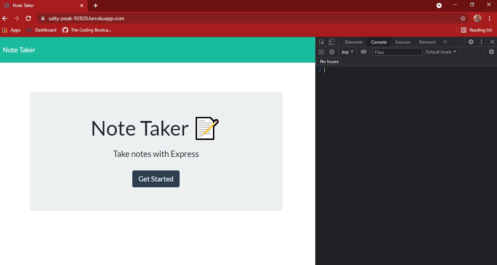
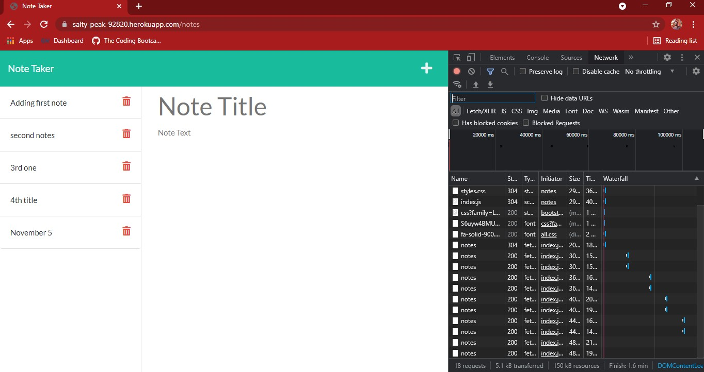
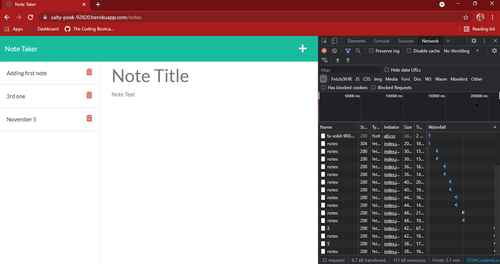

# Note Taker Starter Code

 ## Description

  This is the project for the week 11
  
  ## Table of Contents
  
  
  * [Installation](#installation)
  * [Usage](#usage)
  
  
  ## Installation

  - Please navigate to project folder and open Terminal/Gitbash, run npm install to retrieve the necessary libraries, and Run the following node server.js locally

  
  ## Usage 

  AS A small business owner
  I WANT to be able to write and save notes
  SO THAT I can organize my thoughts and keep track of tasks I need to complete

  ## Tools

  Tools are used Javascript, Node, HTML, CSS

  ## Screenshots & Additional Info

  
  
  
  
  The deployed URL can be found: https://salty-peak-92820.herokuapp.com/
  The URL to the repo: https://github.com/hikod/notetaker

  ## Questions 
    
  https://github.com/hikod

  Please email me for further questions at hikmetdogrul00@gmail.com